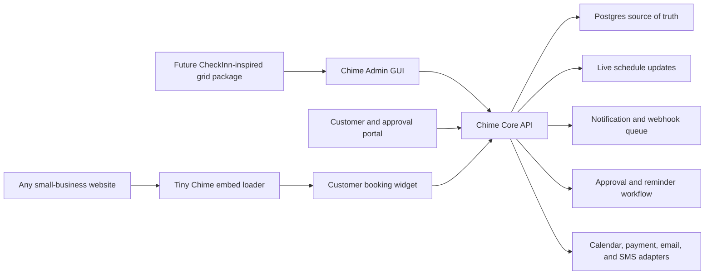
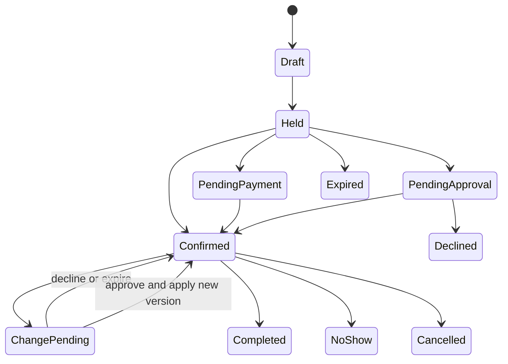

# Chime Small-Business Booking Platform

## Project plan and product outline

Status: planning

## Implementation status

- Phase 0/1 foundation started in August 2026.
- Shared appointment, service, grid, and widget contracts now live under `packages/contracts`.
- Pure appointment and change-request state rules now live under `packages/domain`.
- A non-destructive multi-business Postgres foundation migration now lives under `database/migrations`.
- The existing widget and server remain unchanged, and the migration has not been applied.
- CheckInn remains untouched and is not linked, imported, or required.
- The first separate admin surface now lives under `src/admin`, with its own `admin.html` entry and Vite build configuration.
- The admin schedule currently uses local demonstration data and includes staff filtering, day/week views, appointment creation, drag-to-move, resize handles, and visible approval decisions.
- Admin persistence and authentication are intentionally not wired yet; the existing customer widget and server remain unchanged.
- The no-code Services Studio now edits contract-backed duration ranges, resize increments, buffers, booking windows, pricing, optional deposits, confirmation and change-approval rules, staff assignments, capacity, and customer visibility.
- Schedule and Services are separate working admin views, and service edits remain available while navigating during the current browser session.
- The Services Studio includes a customer-card preview without changing the protected customer booking sequence or exposing internal business rules.
- A standalone tenant-aware administrator API now supports signed sessions, live membership and role checks, organization-scoped service CRUD, optimistic version conflicts, idempotent writes, audit history, and transactional outbox events.
- Services Studio now detects durable API configuration, loads Postgres services, saves new drafts or existing versions, and reports loading, saving, connected, demo, and error states without losing the safe session-only fallback.
- Local seed and environment examples provide a Chime-only demonstration tenant; no backend code imports or reaches CheckInn.

Chime is a portable appointment-booking platform for small businesses. It is
not a vacation-rental product. CheckInn is only a visual and interaction
reference for the administrator calendar.

The product should let a business owner configure and operate Chime through a
clear graphical interface. Adding a new business should not require Christian
to edit source code, rebuild the widget, or maintain a custom fork.

## 1. Product promise

Chime gives a small business everything it needs to accept and manage
appointments:

- A polished booking widget that can be added to almost any website.
- A tactile administrator calendar for creating, moving, and resizing appointments.
- A no-code setup experience for services, hours, staff, rules, forms, branding,
  notifications, deposits, and integrations.
- A simple customer portal for confirming, changing, approving, or cancelling
  an appointment.
- A reliable backend that prevents conflicts, records every important change,
  and keeps customers and staff informed.

## 2. Product boundaries

### Chime is for

- Consultants and professional-service businesses.
- Salons, spas, wellness providers, and personal-care businesses.
- Tutors, instructors, coaches, and trainers.
- Repair, installation, and local technical-service businesses.
- Contractors and mobile or on-site service providers.
- Small teams that share staff, rooms, chairs, equipment, or other appointment resources.

### Chime is not for

- Vacation-rental inventory.
- Nightly stays or occupancy calendars.
- Check-in and check-out operations.
- Housekeeping and turnover workflows.
- Folios, property ledgers, or lodging accounting.
- Unit-owner management.

### CheckInn contribution

CheckInn contributes interaction ideas only:

- A visual time grid.
- Draggable appointment blocks.
- Resize handles for changing appointment duration.
- Clear status colors and overlays.
- A detail panel that opens from the grid.
- Pending-change treatments that remain visible until resolved.

No CheckInn rental schema, business rules, or backend code should be imported
into Chime. The grid can be adapted later after its interaction design is stable.

### CheckInn isolation rule

CheckInn must remain a completely separate product. When Chime is ready for the
grid, the extraction will follow a copy-once process:

- Treat the CheckInn repository as read-only during extraction.
- Identify only generic calendar-grid presentation and interaction code.
- Copy that code into Chime's own `packages/reservation-grid/` directory.
- Remove rental terminology, assumptions, data shapes, and business rules.
- Replace CheckInn data access with Chime's appointment contracts.
- Give the copied grid its own Chime tests, styles, documentation, and release history.
- Never import from the CheckInn repository at build time or runtime.
- Never use a symlink, Git submodule, workspace link, or shared local package.
- Never share a database, API, environment file, credentials, storage, or deployment.
- Never push Chime grid changes back into CheckInn automatically.
- Allow future CheckInn and Chime development to proceed independently.

The extraction is complete only when Chime builds and runs with the CheckInn
folder unavailable and CheckInn has no changed files from the process.

## 3. Non-negotiable principles

- The customer flow remains service, date/time, terms, details, deposit when
  required, and confirmation.
- The platform is multi-business from the beginning.
- Every business configures Chime without touching code.
- The widget never contains private credentials.
- The host website is only an embed host, never Chime's backend.
- Postgres is the durable source of truth for appointments and business settings.
- Appointment conflicts are prevented in a database transaction.
- A change requiring approval never silently overwrites a confirmed appointment.
- Every important action produces an audit event.
- Notifications are retryable and safe to process more than once.
- Accessibility is part of the product, not a later cleanup phase.
- Mobile is optimized for quick administration; desktop is optimized for scheduling.

## 4. Four product surfaces

| Surface | Primary user | Purpose |
| --- | --- | --- |
| Chime Widget | Customer | Discover services and book an appointment |
| Chime Admin | Owner, manager, staff | Configure the business and operate the schedule |
| Chime Portal | Customer or tagged approver | Review, approve, decline, reschedule, or cancel |
| Chime Core API | All Chime clients | Enforce scheduling, permissions, payments, and notifications |

## 5. Target architecture



## 6. Recommended project structure

```text
apps/
  widget/                 customer-facing booking experience
  admin/                  business setup and schedule operations
  portal/                 customer manage and approval experience
  api/                    public, portal, and administrator APIs

packages/
  contracts/              shared API payloads and validation schemas
  domain/                 appointment rules and state transitions
  embed-loader/           tiny script used by host websites
  theme/                  design tokens, presets, and accessibility checks
  reservation-grid/       future CheckInn-inspired appointment grid
  sdk/                    optional JavaScript integration SDK

workers/
  notifications/          email, SMS, push, and webhook delivery
  reminders/              scheduled reminders and expired-hold cleanup
```

The existing Chime source can be migrated into this structure gradually. A
large rewrite is not required on day one.

## 7. Core small-business model

The scheduling engine should model appointments using a small set of reusable
concepts.

| Concept | Responsibility |
| --- | --- |
| Organization | One subscribing business and its settings |
| Location | A physical, virtual, or mobile-service location |
| Member | Owner, administrator, manager, staff member, or viewer |
| Service | What the customer books |
| Staff | A person who can perform one or more services |
| Resource | Optional room, chair, bay, device, or vehicle |
| Customer | A person booking or participating in an appointment |
| Availability rule | Recurring working hours and booking windows |
| Availability exception | Holiday, time off, closure, or special opening |
| Appointment | Confirmed or pending scheduled work |
| Appointment hold | Short-lived protection while a customer completes booking |
| Change request | A proposed adjustment awaiting a decision |
| Approval | An approve or decline decision from an authorized person |
| Notification | A recorded delivery attempt for email, text, or webhook |
| Audit event | An immutable record of who changed what and when |
| Widget configuration | Published services, fields, rules, and visual theme |

Every business-owned record must include `organization_id`. Every editable
appointment must include a version number for conflict detection.

## 8. Service configuration

The service editor should support common small-business needs without custom code:

- Name, description, category, and image or icon.
- Default duration and allowed duration range.
- Time increment, such as 10, 15, or 30 minutes.
- Preparation and cleanup buffers.
- Price, free service, optional deposit, or required deposit.
- Auto-confirmation or manual approval.
- Customer cancellation and rescheduling windows.
- Earliest and latest booking limits.
- Staff members who can perform the service.
- Optional resources required by the service.
- Location, video, phone, or on-site delivery.
- Capacity for one-to-one or small-group appointments.
- Custom questions and required customer fields.
- Terms and policies.
- Notification and reminder schedule.
- Visibility in the public widget.

## 9. Appointment states



The database, API, widget, admin GUI, and notifications must all use the same
state definitions.

## 10. Administrator calendar experience

The calendar is the operational center of Chime Admin.

### Calendar views

- Day view for detailed scheduling.
- Week view for staff planning.
- Agenda view for quick mobile triage.
- Staff lanes for teams.
- Optional resource lanes for rooms or equipment.

### Tactile interactions

- Drag on empty time to create an appointment.
- Drag an appointment to propose or apply a new time.
- Resize the top or bottom edge to adjust duration.
- Snap changes to the business's configured time increment.
- Show the original block while a proposed move is pending.
- Show the proposed block as a distinct ghost block.
- Display conflicts before the administrator drops the block.
- Open a detail drawer without leaving the calendar.
- Provide an undo grace period for changes that do not require approval.
- Support keyboard equivalents for every drag and resize action.
- Announce scheduling changes to assistive technology.

### Appointment detail drawer

- Customer and contact information.
- Service, staff, location, and resources.
- Current date, time, duration, and status.
- Payment and deposit status.
- Customer answers and internal notes.
- Notification history.
- Change-request history.
- Audit timeline.
- Approve, decline, move, resize, cancel, complete, and mark no-show actions.

## 11. Appointment adjustment and approval workflow

Approval behavior should be configurable by the business and service.

### Immediate-change mode

1. The administrator drags or resizes the appointment.
2. Chime validates staff, resource, buffer, and overlap rules.
3. Chime writes the new appointment version atomically.
4. Chime records an audit event.
5. Chime sends an appointment-updated notification.

### Approval-required mode

1. The administrator drags or resizes a confirmed appointment.
2. Chime keeps the confirmed appointment unchanged.
3. Chime creates a change request containing the old and proposed values.
4. The grid shows the confirmed block plus a pending ghost block.
5. Chime notifies the tagged customer or staff member using a secure link.
6. The recipient approves, declines, or proposes another time.
7. Approval triggers a fresh conflict and version check.
8. Chime applies the change atomically only if the appointment is still current.
9. Chime notifies everyone and closes the pending state.
10. Decline or expiration removes the ghost block and preserves the appointment.

This workflow should never rely only on a notification. The pending decision
must remain visible in the calendar, appointment drawer, portal, and approval inbox.

## 12. Chime Admin information architecture

| Area | What the business can do |
| --- | --- |
| Today | See arrivals, changes, gaps, payments, and urgent actions |
| Calendar | Create, move, resize, assign, and review appointments |
| Approval inbox | Resolve pending customer and staff decisions |
| Customers | Review history, notes, preferences, and communication |
| Services | Configure duration, price, staff, fields, and rules |
| Team | Invite members and manage roles, skills, and hours |
| Availability | Paint working hours, breaks, closures, and exceptions |
| Locations and resources | Configure rooms, equipment, and service areas |
| Booking form | Add, remove, reorder, and require customer questions |
| Appearance | Set colors, typography, radius, logo, and widget layout |
| Notifications | Edit templates, channels, timing, and recipients |
| Payments | Connect a provider and configure deposits and refunds |
| Integrations | Connect calendars, webhooks, and other business tools |
| Embed | Preview the widget and copy installation code |
| Audit and security | Review activity, sessions, permissions, and API keys |

## 13. No-code personalization

The administrator should be able to change the product without code.

### Setup wizard

1. Create the business profile.
2. Choose a starter template by business type.
3. Add services and durations.
4. Add staff and optional resources.
5. Paint normal business hours.
6. Choose confirmation, cancellation, and approval rules.
7. Configure questions, terms, deposits, and reminders.
8. Choose a visual preset and adjust approved design tokens.
9. Preview desktop and mobile booking.
10. Copy the embed snippet or share a hosted booking link.

### Visual editor

- Live widget preview.
- Accessible color controls with contrast warnings.
- Logo and business imagery.
- Font presets rather than arbitrary unsafe font injection.
- Corner radius, spacing density, and card style.
- Button and accent treatments.
- Customer-facing labels and descriptions.
- Save draft, preview, publish, and restore previous version.

The published widget configuration should be stored and versioned in Chime.
Changing appearance should not require rebuilding JavaScript.

## 14. Portable widget strategy

The long-term embed should be a tiny loader script that creates a Chime-hosted,
isolated widget surface.

```html
<div data-chime-booking="business-public-id"></div>
<script async src="https://cdn.example.com/chime/embed.js"></script>
```

Recommended behavior:

- The host page supplies only a public business identifier.
- The widget downloads its published configuration from Chime.
- Secrets and private administrator settings never reach the browser.
- The widget is isolated from host React versions, CSS, and JavaScript.
- The loader manages responsive height and emits documented booking events.
- The business can use the same configuration on multiple websites.
- Chime can release new widget versions without asking every customer to rebuild.
- A hosted booking page is available when a business cannot install a script.

## 15. Customer and approver portal

Customers should not be forced to create an account for ordinary appointment tasks.

- Secure magic-link access.
- View appointment details.
- Add the appointment to a calendar.
- Approve or decline a proposed adjustment.
- Suggest another available time.
- Reschedule within business rules.
- Cancel within business rules.
- Update contact details.
- Review payment or deposit status.
- See a concise history of changes.

An optional customer account can be added later for repeat bookings and saved preferences.

## 16. API outline

### Public widget API

- `GET /v1/public/businesses/:publicId/config`
- `GET /v1/public/businesses/:publicId/services`
- `GET /v1/public/businesses/:publicId/availability`
- `POST /v1/public/businesses/:publicId/holds`
- `POST /v1/public/businesses/:publicId/appointments`
- `POST /v1/public/businesses/:publicId/payment-intents`

### Portal API

- `GET /v1/portal/appointments/:token`
- `POST /v1/portal/appointments/:token/change-requests`
- `POST /v1/portal/change-requests/:token/approve`
- `POST /v1/portal/change-requests/:token/decline`
- `POST /v1/portal/change-requests/:token/counter`
- `POST /v1/portal/appointments/:token/cancel`

### Administrator API

- CRUD for organizations, services, staff, resources, and locations.
- CRUD for availability rules and exceptions.
- Calendar queries by date, staff, resource, service, and status.
- Appointment create, move, resize, assign, cancel, and status actions.
- Change-request create, approve, decline, withdraw, and expire actions.
- Widget configuration draft, preview, publish, and rollback actions.
- Notification-template and delivery-history actions.
- Integration, webhook, audit, and API-key actions.

All write endpoints should accept an idempotency key. Appointment edits should
also include the version the administrator last saw.

## 17. Backend reliability design

### Postgres responsibilities

- Canonical business, appointment, customer, and configuration data.
- Transactional conflict prevention.
- Appointment and change-request versions.
- Immutable audit and domain events.
- Notification outbox records.
- Payment and terms records.

### Short-lived coordination

- Temporary customer booking holds.
- Live administrator grid presence.
- Real-time appointment updates.
- Drag and resize coordination when two administrators view the same schedule.

Cloudflare Durable Objects are a possible fit for this coordination layer
because each object provides private, transactional, strongly consistent
storage. Postgres should remain the durable source of truth.

### Background work

- Email and SMS delivery.
- Reminder scheduling.
- Calendar synchronization.
- Webhook delivery.
- Expired hold and change-request cleanup.
- Retry and dead-letter handling.

Cloudflare Queues can support this layer, but consumers must be idempotent
because queue delivery is at least once. Cloudflare Workflows are a possible
orchestration option for approval waits, reminders, and timeouts; canonical
approval state should still be stored in Postgres.

### Database access

If Chime's API is deployed on Cloudflare Workers while Postgres remains the
database, Hyperdrive can provide the Worker-to-Postgres connection layer.

## 18. Security and tenancy

- Enforce `organization_id` server-side on every business-owned query.
- Use roles for owner, administrator, manager, staff, and viewer.
- Keep administrator authentication separate from public widget access.
- Use short-lived, single-purpose signed portal tokens.
- Encrypt integration credentials and rotate secrets.
- Require multifactor authentication for owners and administrators before launch.
- Rate-limit public availability, hold, booking, and portal endpoints.
- Validate all widget payloads on the server.
- Verify deposits server-side before creating paid appointments.
- Never trust price, duration, service rules, or tenant identity from the widget.
- Record security-sensitive actions in the audit log.
- Provide data export, retention, and deletion controls.

## 19. Future isolated grid extraction and adapter

The future grid component will be a Chime-owned copy, not a connection to
CheckInn. It should not fetch data or know Chime's database schema. It should
receive normalized appointments and emit user intentions.

```ts
type GridAppointment = {
  id: string
  version: number
  startsAt: string
  endsAt: string
  status: string
  staffIds: string[]
  resourceIds: string[]
  customerLabel: string
  serviceLabel: string
  pendingChange?: {
    startsAt: string
    endsAt: string
    status: 'pending' | 'approved' | 'declined'
  }
}

type GridCommand =
  | { type: 'create'; startsAt: string; endsAt: string; staffId?: string }
  | { type: 'move'; appointmentId: string; version: number; startsAt: string; endsAt: string }
  | { type: 'resize'; appointmentId: string; version: number; startsAt: string; endsAt: string }
  | { type: 'assign'; appointmentId: string; version: number; staffId?: string; resourceId?: string }
```

Chime Admin will translate each command into an API request. The API decides
whether the command applies immediately or becomes a pending change request.
No part of this package may resolve code, configuration, or data from CheckInn.

## 20. Delivery roadmap

The sequence matters more than the calendar estimate. The following is a rough
single-developer planning range, not a delivery promise.

| Phase | Focus | Rough range | Exit criteria |
| --- | --- | --- | --- |
| 0 | Product contracts and repository boundaries | 1 week | Approved terminology, states, roles, and API boundaries |
| 1 | Multi-business domain and database | 2-3 weeks | Tenant-safe services, staff, availability, appointments, holds, and audit events |
| 2 | Business setup and service editor | 2-3 weeks | A new business can configure Chime without code |
| 3 | Portable widget v1 | 2 weeks | One embed works on unrelated test websites without CSS or React conflicts |
| 4 | Administrator calendar v1 | 3-4 weeks | Admin can create, move, resize, assign, and inspect appointments |
| 5 | Change requests and approvals | 2-3 weeks | Pending ghost changes, portal decisions, atomic apply, and history work end to end |
| 6 | Notifications and integrations | 2-3 weeks | Reliable email, SMS adapter, reminders, calendar adapter, and webhooks |
| 7 | No-code appearance and form editor | 2-3 weeks | Draft, preview, publish, and rollback work without rebuilding code |
| 8 | Isolated grid copy and Chime adaptation | Scheduled later | Chime-owned grid passes appointment scenarios with CheckInn unavailable and unchanged |
| 9 | Beta hardening | 2-3 weeks | Security, accessibility, concurrency, backups, monitoring, and support tools pass |

## 21. Minimum lovable product

The first small-business beta should prove the complete loop:

- A business creates an organization.
- The business adds services, staff, hours, and booking rules.
- The business personalizes the widget in a GUI.
- The business copies one embed snippet into an unrelated website.
- A customer books an appointment through the existing Chime flow.
- The backend prevents double booking under simultaneous requests.
- The appointment appears in the administrator calendar immediately.
- The administrator drags and resizes an appointment.
- Chime either applies the change or creates a pending approval based on settings.
- The tagged customer approves or declines through a secure link.
- Both parties receive accurate notifications.
- Every state change appears in the audit timeline.
- The business never asks Christian to modify source code for normal setup.

## 22. Explicitly deferred features

- Vacation-rental and nightly-stay features.
- Copying any CheckInn grid code before its interactions stabilize.
- Linking Chime to the CheckInn repository, packages, data, or deployment.
- Native iOS and Android applications.
- Payroll, commissions, and full accounting.
- Marketplace discovery.
- AI-controlled scheduling decisions.
- Every possible calendar or payment provider in the first release.
- Deep vertical-specific workflows before the general appointment engine is proven.

## 23. Primary risks and controls

| Risk | Control |
| --- | --- |
| Product becomes a collection of special cases | Keep one appointment model and configurable policies |
| Widget becomes coupled to customer websites | Host configuration and backend centrally; isolate the embed |
| Dragging causes silent schedule corruption | Version checks, conflict checks, approval states, and audit events |
| Notifications are duplicated or lost | Transactional outbox, idempotency keys, retries, and delivery history |
| Multi-business data leaks | Tenant scoping in every API and automated isolation tests |
| Customization creates inaccessible designs | Constrained tokens, presets, and automatic contrast checks |
| CheckInn introduces rental concepts | Copy only generic interactions, then remove all rental contracts and terminology |
| Chime changes accidentally affect CheckInn | Read-only extraction, no links, independent files, and a clean CheckInn working tree |
| Scope grows before the core works | Gate each phase with end-to-end exit criteria |

## 24. Recommended first implementation slice

The first build slice should be deliberately small and foundational:

1. Convert the existing database into an organization-aware schema.
2. Add organizations, members, roles, staff, locations, and recurring availability rules.
3. Replace pre-generated slot dependence with availability calculation plus short-lived holds.
4. Extract appointment rules from Express route handlers into a tested domain package.
5. Define appointment and change-request state machines.
6. Build a basic authenticated admin shell.
7. Build the service editor and business-hours painter.
8. Render existing appointments in a simple calendar before adding drag and resize.
9. Prove tenant isolation and concurrent booking protection.
10. Only then add tactile grid interactions and approval workflows.

## 25. Decisions to confirm before implementation

Recommended defaults are included so planning can continue without blocking.

| Decision | Recommended default |
| --- | --- |
| First beta audience | Appointment-based Kauai small businesses |
| Customer account | Not required; secure magic links |
| Administrator authentication | Managed identity provider with MFA |
| Default confirmation | Automatic, configurable per service |
| Change approval | Optional per service; customer approval for material changes |
| Payments | Adapter-based; retain server-side verification |
| Notifications | Email first, SMS second |
| Calendar integration | One provider first, adapter interface from day one |
| Widget isolation | Chime-hosted isolated surface with tiny loader |
| Source of truth | Postgres |
| CheckInn timing | Copy once after its grid interactions are stable; never link the products |

## 26. Definition of success

Chime succeeds when a nontechnical small-business owner can set up services,
staff, hours, policies, appearance, and notifications; paste one snippet into a
website; confidently operate appointments in a tactile calendar; and negotiate
schedule changes with customers without Christian changing code or manually
repairing data.

## Current infrastructure references

- [Cloudflare Hyperdrive](https://developers.cloudflare.com/hyperdrive/) can connect Workers to an existing Postgres database.
- [Cloudflare Durable Objects](https://developers.cloudflare.com/durable-objects/concepts/what-are-durable-objects/) provide strongly consistent stateful coordination and may support live grid presence and short-lived coordination.
- [Cloudflare Queues delivery guarantees](https://developers.cloudflare.com/queues/reference/delivery-guarantees/) require idempotent consumers because delivery is at least once.
- [Cloudflare Workflows events](https://developers.cloudflare.com/workflows/build/events-and-parameters/) can wait for human approval events and timeouts while Postgres retains canonical state.
